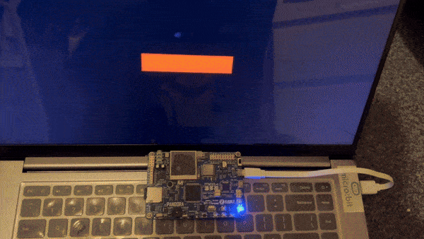

<!-- TOC start (generated with https://github.com/derlin/bitdowntoc) -->

- [Zephyr Device Tree Examples](#zephyr-device-tree-examples)
   * [Quick Start](#quick-start)
   * [Project 1: GPIO and I2C](#project-1-gpio-and-i2c)
   * [Project 2: SPI LCD (st7789 240x240)](#project-2-spi-lcd-st7789-240x240)
   * [Project 3: LVGL (MIPI DBI)](#project-3-lvgl-mipi-dbi)
   * [Project 4: MCUBoot](#project-4-mcuboot)
   * [Project 5: IMU Filter (ICM20608)](#project-5-imu-filter-icm60208)
   * [Project 6: SD Card File System (SPI)](#project-6-sd-card-filte-system-spi)
   * [Project 7: Wifi HTTP Request (esp-at)](#project-7-wifi-http-request-esp-at)
   * [Project 8: W25Q128 NOR Flash (QSPI)](#project-8-w25q128-nor-flash-qspi)
   * [Project 9: USB CDC (ACM)](#project-9-usb-cdc-acm)
<!-- TOC end -->

<!-- TOC --><a name="zephyr-device-tree-examples"></a>
# Zephyr Device Tree Examples

> $ west flash
>   
> $ st-info --probe  
> $ st-flash --connect-under-reset write build/zephyr/zephyr.bin 0x8000000  
>   
> $ pyocd list  
> $ pyocd flash -t stm32l475xe -a 0x8000000 build/zephyr/zephyr.bin    

<!-- TOC --><a name="quick-start"></a>
## Quick Start

Step 1: Install Zephyr

```
$ pip install west
$ west init ~/zephyrproject

$ cd ~/zephyrproject
$ west update

$ west zephyr-export
$ west packages pip --install
```

Step 2: Install Zephyr-SDK

```
$ cd ~/zephyrproject/zephyr
$ west sdk install
```


Step 3: Hello-World Example

```
$ git clone https://github.com/wuhanstudio/stm32l475-zephyr-bsp
$ cd stm32l475-zephyr-bsp/hello_world

$ source ~/zephyrproject/zephyr/zephyr-env.sh
$ west build -b pandora_stm32l475
$ west flash
```

Step 4: Add modules (Optional)

```
$ west build -b pandora_stm32l475 -t menuconfig
```
```
Subsystems and OS Services  --->
  [*] Shell  --->
Device Drivers  --->
  [*] General-Purpose Input/Output (GPIO) drivers  --->
    [*] GPIO Shell
  [*] Inter-Integrated Circuit (I2C) bus drivers  --->
    [*] I2C Shell
[D] Save minimal config (advanced)
```
```
$ cat build/zephyr/kconfig/defconfig > prj.conf
$ west build -b pandora_stm32l475 -p
$ west flash
```

<!-- TOC --><a name="project-1-gpio-and-i2c"></a>
## Project 1: GPIO and I2C

- i2c device tree: https://github.com/zephyrproject-rtos/zephyr/blob/main/dts/arm/st/l4/stm32l4.dtsi
- gpio pinctrl definition: https://github.com/zephyrproject-rtos/hal_stm32/blob/main/dts/st/l4/stm32l475v(c-e-g)tx-pinctrl.dtsi

```
$ source ~/zephyrproject/zephyr/zephyr-env.sh
$ cd hello_world

$ west build -b pandora_stm32l475
$ west flash
```

Change GPIO pin output and scan I2C bus:

```
# LED: PE8
uart:~$ gpio conf gpio@48001000 8 o
uart:~$ gpio set gpio@48001000 8 0
uart:~$ gpio set gpio@48001000 8 1

# I2C3: i2c3_scl_pc0 &i2c3_sda_pc1
uart:~$ i2c scan i2c@40005c00 
     0  1  2  3  4  5  6  7  8  9  a  b  c  d  e  f
00:             -- -- -- -- -- -- -- -- -- -- -- -- 
10: 10 -- -- -- -- -- -- -- -- -- -- -- -- -- 1e -- 
20: -- -- -- -- -- -- -- -- -- -- -- -- -- -- -- -- 
30: -- -- -- -- -- -- -- -- -- -- -- -- -- -- -- -- 
40: -- -- -- -- -- -- -- -- -- -- -- -- -- -- -- -- 
50: -- -- -- -- -- -- -- -- -- -- -- -- -- -- -- -- 
60: -- -- -- -- -- -- -- -- 68 -- -- -- -- -- -- -- 
70: -- -- -- -- -- -- -- --                         
3 devices found on i2c@40005c00
```

<!-- TOC --><a name="project-2-spi-lcd-st7789-240x240"></a>
## Project 2: SPI LCD (st7789 240x240)

- spi device tree: https://github.com/zephyrproject-rtos/zephyr/blob/main/boards/shields/st7789v_generic/st7789v_tl019fqv01.overlay

```
$ source ~/zephyrproject/zephyr/zephyr-env.sh
$ cd hello_st7789

$ west build -b pandora_stm32l475
$ west flash
```

<!-- TOC --><a name="project-3-lvgl-mipi-dbi"></a>
## Project 3: LVGL (MIPI DBI)


```
$ source ~/zephyrproject/zephyr/zephyr-env.sh
$ cd hello_lvgl

$ west build -b pandora_stm32l475
$ west flash
```

<!-- TOC --><a name="project-4-mcuboot"></a>
## Project 4: MCUBoot

Step 1: Build MCUBoot (bootloader)

```
$ git clone https://github.com/mcu-tools/mcuboot
$ cp mcuboot.overlay mcuboot/boot/zephyr/app.overlay
$ cp mcuboot.conf mcuboot/boot/zephyr/prj.conf

$ source ~/zephyrproject/zephyr/zephyr-env.sh
$ cd mcuboot/boot/zephyr
$ west build -b pandora_stm32l475
$ west flash
```

Step 2: Build Zephyr Application

```
$ source ~/zephyrproject/zephyr/zephyr-env.sh
$ cd hello_mcuboot
$ west build -b pandora_stm32l475

# Write the firmware to slot1
$ west flash

$ pyocd flash -t stm32l475xe -a 0x8010000 build/zephyr/zephyr.signed.confirmed.bin

# Write the firmware to slot2
$ pyocd flash -t stm32l475xe -a 0x8028000 build/zephyr/zephyr.signed.confirmed.bin

# Optional: Manually sign the firmware and write to slot2
$ ../mcuboot/scripts/imgtool.py sign -k ../mcuboot/root-rsa-2048.pem build/zephyr/zephyr.bin build/zephyr/zephyr.signed.test.bin -v 0.0.1 --pad --header-size 0x200 --slot-size 0x18000
$ pyocd flash -t stm32l475xe -a 0x8028000 build/zephyr/zephyr.signed.test.bin
```
<!-- TOC --><a name="project-5-imu-filter"></a>
## Project 5: IMU Filter (ICM60208)



Please wait for this PR to be merged: https://github.com/zephyrproject-rtos/zephyr/pull/79465
```
$ source ~/zephyrproject/zephyr/zephyr-env.sh
$ cd hello_icm20608

$ west build -b pandora_stm32l475
$ west flash

$ pip install pyserial pygame pyopengl
$ python cube.py
```

<!-- TOC --><a name="project-6-sd-card-filte-system-spi"></a>
## Project 6: SD Card File System (SPI)

```
$ source ~/zephyrproject/zephyr/zephyr-env.sh
$ cd hello_sdcard_fs

$ west build -b pandora_stm32l475
$ west flash
```

List all files on the SD card:

```
*** Booting Zephyr OS build v3.7.0-3953-g1bbeeadfbf43 ***
[00:00:00.032,000] <inf> main: Block count 3934208
Sector size 512
Memory Size(MB) 1921
[00:00:00.064,000] <inf> sd: Maximum SD clock is under 25MHz, using clock of 24000000Hz
Disk mounted.
[00:00:00.100,000] <inf> sd: Maximum SD clock is under 25MHz, using clock of 24000000Hz

Listing dir /SD: ...
[FILE] VERSION.ASP (size = 215)
[FILE] INDEX~1.HTM (size = 0)
[DIR ] WEBNET
uart:~$ 
```

<!-- TOC --><a name="project-7-wifi-http-request-esp-at"></a>
## Project 7: Wifi HTTP Request (esp-at)

A very useful post that explains how to flash AT firmware v2.2 to ESP8266:  

(The official released firmware won't work because RX/TX pins were changed for some reason)

https://www.sigmdel.ca/michel/ha/esp8266/ESP01_AT_Firmware_en.html

```
$ source ~/zephyrproject/zephyr/zephyr-env.sh
$ cd hello_at_wifi

$ west build -b pandora_stm32l475
$ west flash

# Start the HTTP server and listening on port 8000
$ python http-server.py
```

Connect to a WIFI and show IP addresses:

```
[00:00:00.100,000] <inf> wifi_esp_at: Waiting for interface to come up
[00:00:00.549,000] <inf> wifi_esp_at: AT version: 2.2.0.0(s-b097cdf - ESP8266 - Jun 17 2021 12:58:29)
[00:00:00.551,000] <inf> wifi_esp_at: SDK version: v3.4-22-g967752e2
[00:00:00.558,000] <inf> wifi_esp_at: Bin version: 2.2.0(ESP8266_1MB)
[00:00:01.041,000] <inf> wifi_esp_at: ESP Wi-Fi ready
[00:00:01.041,000] <dbg> net_tcp: net_tcp_init: (0x20002f98): Workq started. Thread ID: 0x20002078
*** Booting Zephyr OS build v3.7.0-4340-gb5229c99dbec ***

uart:~$ wifi scan
uart:~$ wifi connect -s "<SSID>" -k 1 -p PASS_WORD

uart:~$ net ipv4
IPv4 support                              : enabled
IPv4 fragmentation support                : disabled
IPv4 conflict detection support           : disabled
Max number of IPv4 network interfaces in the system          : 2
Max number of unicast IPv4 addresses per network interface   : 1
Max number of multicast IPv4 addresses per network interface : 2

IPv4 addresses for interface 1 (0x200009e4) (IP Offload)
======================================================
Type      	State    	Ref	Address
DHCP  	preferred    	1	192.168.1.106/255.255.255.0

IPv4 addresses for interface 2 (0x20000aec) (Dummy)
=================================================
Type      	State    	Ref	Address
autoconf  	preferred    	1	127.0.0.1/255.0.0.0
```

<!-- TOC --><a name="project-8-w25q128-nor-flash-qspi"></a>
## Project 8: W25Q128 NOR Flash (QSPI)

**Known issue** (solved): https://github.com/zephyrproject-rtos/zephyr/issues/75345

**Solution**: Change the write command to `0x32`.  

The default value: `PP_1_4_4` uses the write command `0x38`, which is not supported by w25q128jv. 

```
&w25q128jv {
    writeoc = "PP_1_1_4";
}
```

```
$ source ~/zephyrproject/zephyr/zephyr-env.sh
$ cd hello_qspi_flash

$ west build -b pandora_stm32l475
$ west flash
```

<!-- TOC --><a name="project-9-usb-cdc-acm"></a>
## Project 9: USB CDC (ACM)

Use UART1 for console output and USB CDC (ACM) for Zephyr shell.

```
/ {
	chosen {
		zephyr,console = &usart1;
		zephyr,shell-uart = &cdc_acm_uart0;
	};
};
```

```
$ source ~/zephyrproject/zephyr/zephyr-env.sh
$ cd hello_usb_cdc

$ west build -b pandora_stm32l475
$ west flash
```
